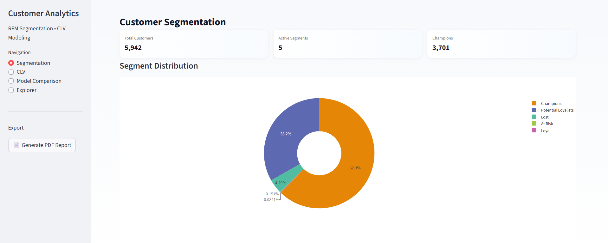

<h1 align="center">🛒 Customer Analytics Pipeline — Segmentation & CLV Prediction</h1>

  
  
  

---

## 📘 Overview

The **Customer Analytics Pipeline** is a complete, end-to-end machine learning workflow that converts raw customer transaction data into:

- 🎯 Customer segmentation  
- 📊 Behavioral insights  
- 💰 90-day Customer Lifetime Value (CLV) predictions  
- 📈 Interactive dashboards  
- 📄 Automated multi-page PDF business reports  

It follows a **modular, production-ready architecture** and is built for:

✔ Real business deployments  
✔ MNC data science & engineering interviews  
✔ Portfolio projects  
✔ Enterprise analytics  

---

## 🚀 Key Features

### 🔹 1. RFM Feature Engineering  
Automatically generates:
- Recency  
- Frequency  
- Monetary Total  
- Monetary Average  
- Monetary Variance  

---

### 🔹 2. Smart Customer Segmentation (K-Means)
Creates actionable customer groups:
- 🏆 Champions  
- 💎 Loyal  
- 🌱 Potential Loyalists  
- ⚠️ At-Risk  
- ❌ Lost  

---

### 🔹 3. CLV Prediction  
Trains and compares **7 regression models**:

| Model | Included |
|-------|----------|
| Linear Regression | ✔ |
| Ridge | ✔ |
| Lasso | ✔ |
| Random Forest | ✔ |
| Extra Trees | ✔ |
| Gradient Boosting | ✔ |
| XGBoost | ✔ |

➡️ **Best-performing model is automatically selected using MAE.**

---

### 🔹 4. Modern Streamlit Dashboard  
Includes:
- KPI Cards  
- Segment Distribution  
- RFM Scatter Visuals  
- CLV Distribution  
- Model Comparison  
- Customer Explorer  
- CSV Export  

---

### 🔹 5. Automated PDF Reporting  
Exports a professional multi-page PDF containing:
- Executive Summary  
- Segment Insights  
- Model Comparison Tables  
- CLV Predictions  
- Visualizations  

---

## 🖼️ Dashboard Preview

